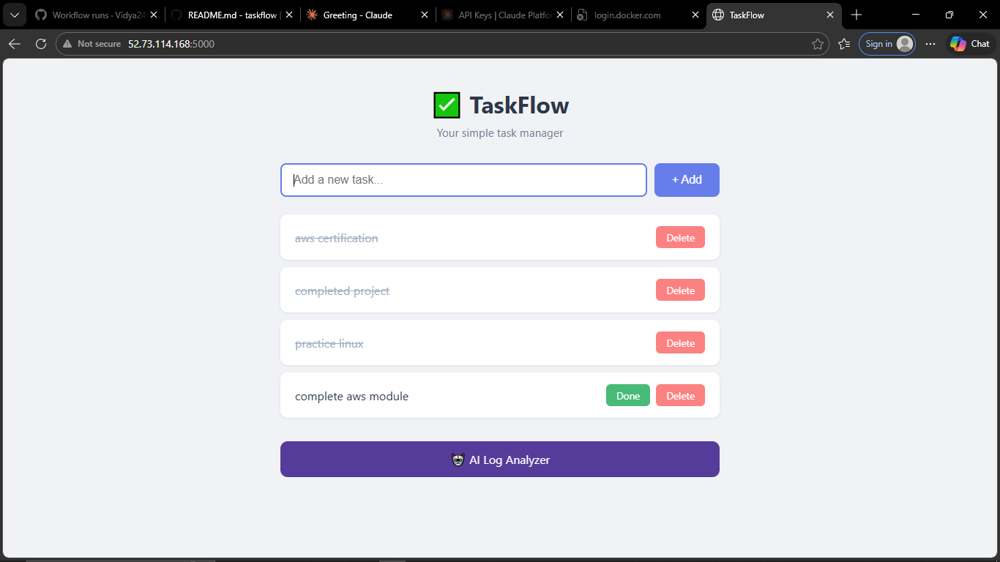
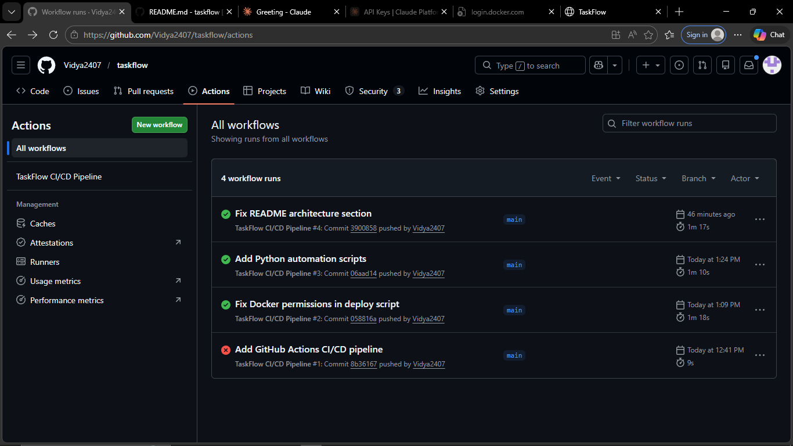
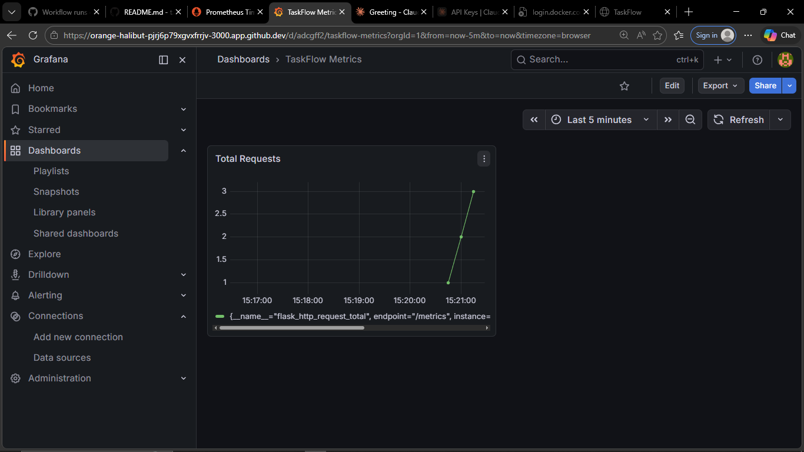
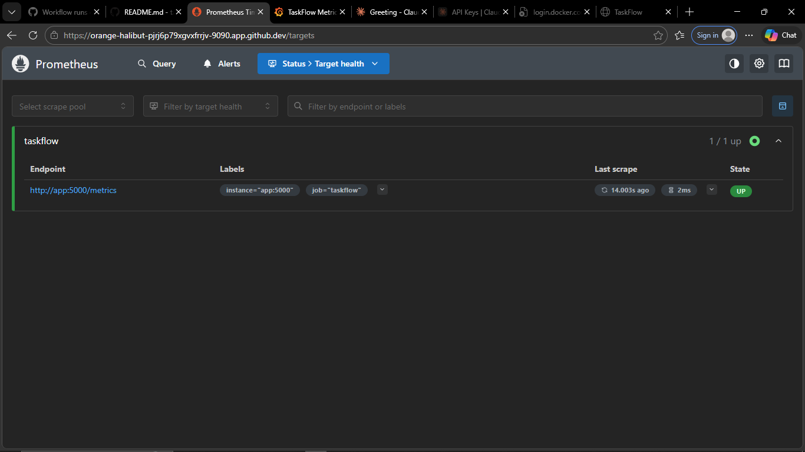
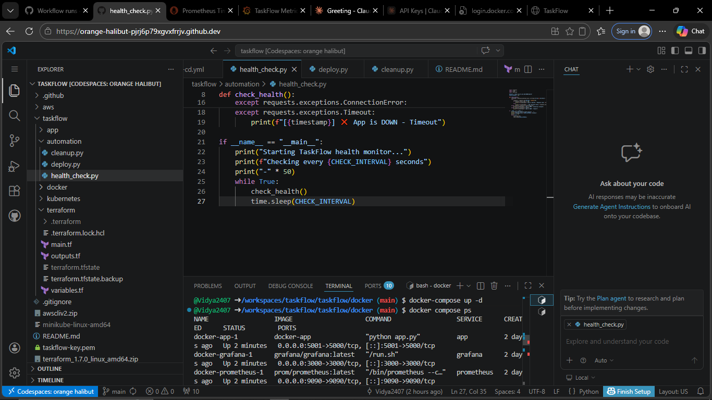

# TaskFlow — Full Stack DevOps Project

A Python Flask task manager app with a complete production-grade DevOps pipeline.

## 🌐 Live Demo
App: http://52.73.114.168:5000

## 🏗️ Architecture
A full DevOps pipeline from code to cloud:

**Developer** → GitHub → GitHub Actions → DockerHub → AWS EC2

With local testing via Docker Compose and Kubernetes (Minikube), and monitoring via Prometheus and Grafana.

## 🛠️ Tech Stack

| Category | Tools |
|---|---|
| **Application** | Python, Flask, SQLite |
| **AI Feature** | Claude API (Anthropic) |
| **Containerization** | Docker, DockerHub |
| **Orchestration** | Kubernetes (Minikube) |
| **Infrastructure** | Terraform, AWS EC2, VPC |
| **CI/CD** | GitHub Actions |
| **Monitoring** | Prometheus, Grafana |
| **Automation** | Python scripts |
| **Dev Environment** | GitHub Codespaces |

## 🚀 Features

- ✅ Task manager web app — add, complete, delete tasks
- 🤖 AI log analyzer — paste errors, Claude explains the fix
- 📊 Live monitoring dashboard with Prometheus and Grafana
- 🔄 Fully automated CI/CD pipeline
- ☁️ Deployed on AWS EC2 with Terraform

## 📁 Project Structure
```
taskflow/
├── app/                    # Flask application
│   ├── app.py              # Main app
│   ├── ai_assistant.py     # Claude AI integration
│   └── templates/          # HTML pages
├── automation/             # Python scripts
│   ├── health_check.py     # Monitor app health
│   ├── deploy.py           # Deploy to EC2
│   └── cleanup.py          # Destroy AWS resources
├── docker/                 # Docker configs
│   ├── docker-compose.yml
│   └── prometheus.yml
├── kubernetes/             # K8s manifests
│   ├── deployment.yaml
│   ├── service.yaml
│   └── configmap.yaml
├── terraform/              # AWS infrastructure
│   ├── main.tf
│   ├── variables.tf
│   └── outputs.tf
└── .github/workflows/      # CI/CD pipeline
    └── ci-cd.yml
```

## ⚙️ How to Run Locally

**Clone the repo:**
```bash
git clone https://github.com/Vidya2407/taskflow.git
cd taskflow
```

**Run with Docker:**
```bash
cd taskflow/docker
docker-compose up --build
```

**Open in browser:**
```
App:        http://localhost:5000
Prometheus: http://localhost:9090
Grafana:    http://localhost:3000
```

## 🔄 CI/CD Pipeline

Every push to main branch automatically:
1. Runs tests
2. Builds Docker image
3. Pushes to DockerHub
4. Deploys to AWS EC2

## 📊 Monitoring

Prometheus scrapes metrics from `/metrics` endpoint every 15 seconds.
Grafana visualizes request count, response time and error rate.

## 🐍 Python Automation Scripts
```bash
# Monitor app health every 60 seconds
python automation/health_check.py

# Deploy latest image to EC2
python automation/deploy.py

# Destroy all AWS resources
python automation/cleanup.py
```

## 📸 Screenshots

### Live App on AWS EC2


### GitHub Actions CI/CD Pipeline


### Grafana Monitoring Dashboard


### Prometheus Targets


### Docker Containers Running


## 👩‍💻 Author
Vidya Vihasini C S
- GitHub: [@Vidya2407](https://github.com/Vidya2407)